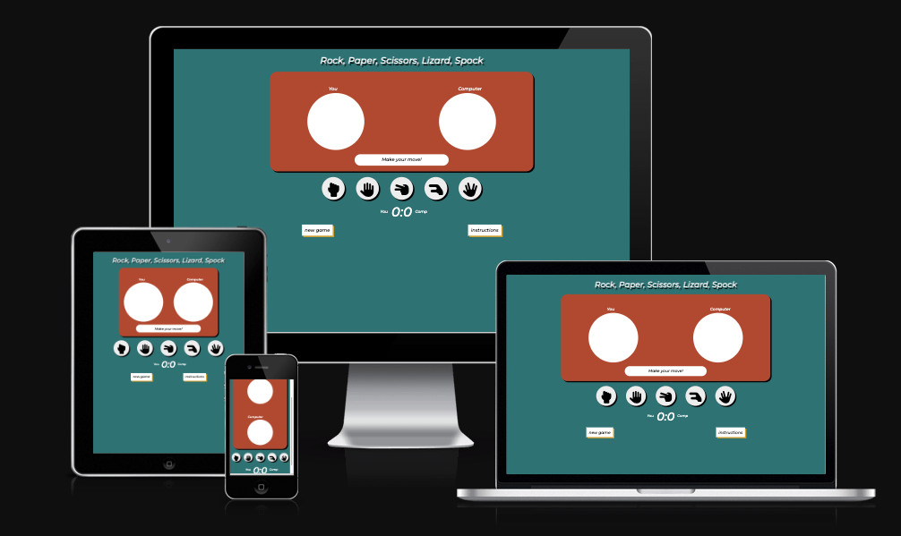
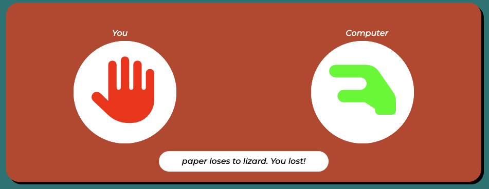
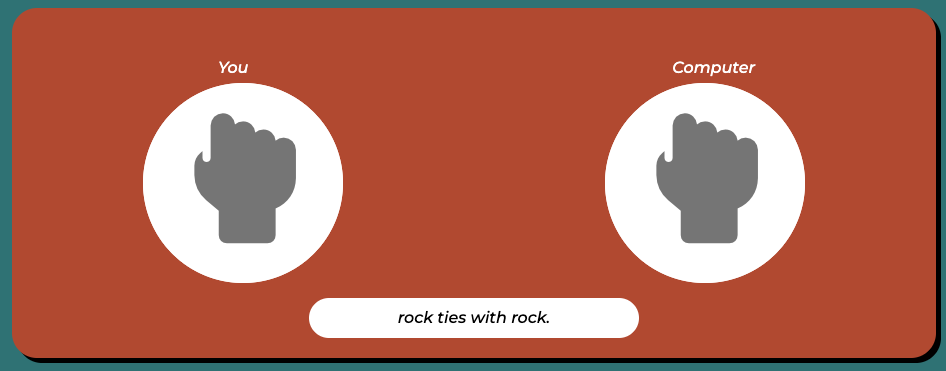
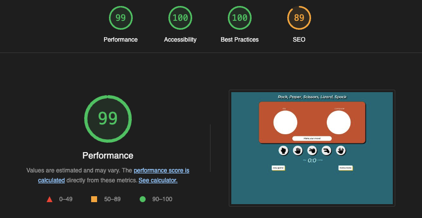

# Rock, Paper, Scissors, Lizard, Spock Game

The rock, paper, scissors, lizard, spock game website is a page for users who want to play an online game that has elements of chance. It is a slightly different version to the original rock, paper, scissors game, as it adds two new options, thus making a game a little more complicated. Users of this site are able to play against the computer that bases its choice on a random generated number. Just like a person would do, the computer chooses by random.

Technologies used to make this website are HTML5, CSS3 and JavaScript.

The webpage is interactive and responsive

# Features

## header

The landing page features a header with the name of the game. This has no other purpose than to tell te user what game they are about to play.

## Main game area

* In this section of the game, the user is introduced to the main game area, where two circles indicates the place where the moves of the user and the computer is going to be compared.
* Above the circles are their related labels. Below the circles a short message area can be found where the text is changed based on the state of the game.

* After the user makes his move, the winning shape is going to glow up green and the losing shape is going to glow up red for a short period of time, and a message shows up based on the rules of the game, so the user receives clear response to their actions. If the user draws with the computer, -meaning they pick the same shape- the icons will glow up with a grey color and none of the scores are updated.

* The following screenshot is when the user loses.

* The following screenshot is when the user and computer draws.

## Shapes area

* In this part of the game the user can find the options the game offers them to choose from. 
* They can find the shapes that are mentioned in the name of the game respectively, Rock, Paper, Scissors, Lizard and Spock.
* Hovering over the shapes makes them stand out from the other buttons, and attracts the user's attention, while reinforcing their choice. Clicking one of the buttons will make a slightly bigger version of their corresponding icons appear in the main game area mentioned above.
* Whether the user loses, ties or wins, the color of the icons above changes accordingly.

## Scoreboard

* In this small section of the game the scoreboard can be found which is increasing every time the user or the computer wins one round. If the result is draw, none of the scores are incremented. 
* The winner is determined after reaching 10 points.
When the winner is announced, a modal appears on-screen that tells the user wether he has won or lost.

* Here the user is offered to play again, where both the computer and the user start from 0 points, and the game over modal disappears.

## Buttons

### new game

* This button has the same functionality as the play again button, except this button is always visible, and it gives an option for the user to restart the game and reset the scores whenever they feel like it.

### instructions

* This button makes a modal appear on the screen which tells the user the rules of the game.

* clicking the close button or clicking anywhere outside the modal will make it disappear.

# Testing

* I have tested that the page works in Google Chrome browser and Safari browser.
* I have confirmed that site is responsive, easy to read, looks decent and works well on standard screensizes using the devtools device in the browser tab.
* I have confirmed that the functions of the game work perfectly without any bugs.

## Bugs
* I am aware of a bug that rarely occurs on the desktop version where a button is being clicked and nothing happens, although I have not found a solution to this problem.

## Validator testing

* JSHint
    * no errors were returned after using JSHint JavaScript Code Validator.

* W3C validator
    * no errors were returned after passing the code through W3C HTML validator.

* Jigsaw validator
    * no errors were returned after using the W3C CSS Jigsaw validator.

# Accessibility

* The lighthouse extension returned an overall satisfactoy score.

# Deployment 

The website was deployed to GitHub pages, with the followings steps

1. Sign in to GitHub account 
2. in the GitHub repository of the project, navigate to settings tab with the gear icon
3. From the menu located on the left-hand side, select the Pages option
4. Under the branch drop-down menu, select main, then press save
5. Once saved, the page provided the link to the completed and live website.

The live link can be found here: [Rock, Paper, Scissors, Lizard, Spock](https://gaborficsor.github.io/rock-paper-scissor-lizard-spock-game/)

# Credits

* The code to make the main game function work was partially taken from [freeCodeCamp's tutorial video on YouTube](https://www.youtube.com/watch?v=jaVNP3nIAv0)
    * game function
    * main function
    * function to make random number
    * win tie and lose functions

* To make the modals that appear on screen the code was partially taken from [W3S' how to make a modal tutorial](https://www.w3schools.com/howto/howto_css_modals.asp)

* The code to make the icon appear based on the computer's choice was achieved with the help of a member of Code Institute's tutor team

* The game design was inspired by Code Institute's Love Math Project.

# Media
* icons were taken from [font awesome](https://fontawesome.com/)
* instructions image was taken from [Google Images > BigBang Theory Fandom ](https://bigbangtheory.fandom.com/wiki/Rock,_Paper,_Scissors,_Lizard,_Spock)
* favicon was made with [Fonticon](https://gauger.io/fonticon/)
# Purpose

* this website was made for education purposes only
* this website was made by Gabor Ficsor, student at Code Institute